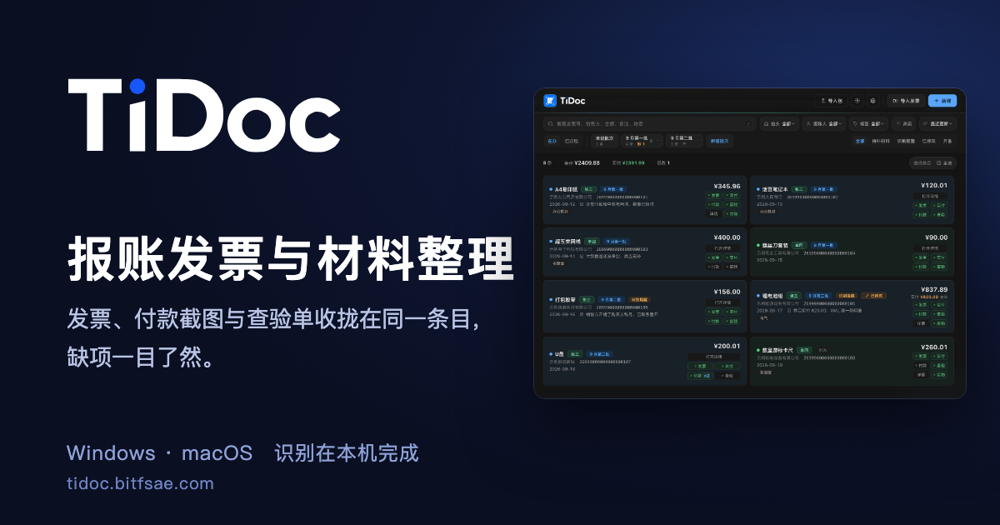

<p align="center">
  <a href="https://tidoc.bitfsae.com"></a>
</p>

# Tidoc

[](https://github.com/totok22/tidoc/actions/workflows/ci.yml)
[](https://github.com/totok22/tidoc/actions/workflows/release.yml)
[](https://github.com/totok22/tidoc/actions/workflows/docs.yml)
[](LICENSE)

> 通用的报账凭证管理与整理工具。

**[文档站 tidoc.bitfsae.com](https://tidoc.bitfsae.com)**　·　[下载安装](https://tidoc.bitfsae.com/start/install.html)　·　[快速入门](https://tidoc.bitfsae.com/start/quickstart.html)　·　[演示视频](https://www.bilibili.com/video/BV1XN3q69EPi/)　·　[常见问题](https://tidoc.bitfsae.com/faq.html)

Tidoc 是一款跨平台桌面程序（Windows、macOS），以一张发票为工作单元，完成发票导入、材料补齐、识别提醒、筛选和批次整理，并导出可交换或打印的报账材料。适合个人、团队和社团使用。

- **整理**：把一张发票和对应付款截图、实物图、查验单放在同一个条目中。
- **核对**：集中查看待补材料、识别提醒、实付差异和阿里云识别结果。
- **协作**：通过 `.tidoc` 绑定包交接完整条目和附件。
- **输出**：生成总览 Excel、附件整理包、材料 PDF，以及报账方案定义的 Word 文档。
- **存储**：业务数据和附件保存在本机，可整体迁移和备份。

## 下载

- [文档站下载页](https://tidoc.bitfsae.com/start/install.html)：直接提供 Windows 和 macOS 最新版安装包的下载按钮。
- [GitHub Releases](https://github.com/totok22/tidoc/releases/latest)：下载最新 Windows 或 macOS 安装包。
- [BITFSAE 官网](https://www.bitfsae.com/)：首页底部选择「报账软件」。

Windows 下载 `tidoc-core-windows-v{version}.exe` 后按提示安装。macOS 下载 `tidoc-core-macos-v{version}.dmg`，打开后把 Tidoc 拖入“应用程序”。

## 使用

使用方法只在文档站维护，这里不重复：

- [快速入门](https://tidoc.bitfsae.com/start/quickstart.html)：五步走完选择方案、导入发票、补齐材料、核对、整理并导出。
- [基本概念](https://tidoc.bitfsae.com/guide/concepts.html)：条目、材料、报账人、标签、报账批次、绑定包、识别提醒等词的含义。
- [使用指南](https://tidoc.bitfsae.com/guide/import.html)：导入、补齐材料、核对、批次、导出打印、报账方案和快捷操作。
- [阿里云 OCR](https://tidoc.bitfsae.com/guide/aliyun-ocr.html)：可选的云识别，开通和配置步骤。
- [设置与数据](https://tidoc.bitfsae.com/guide/settings.html)：数据位置、备份恢复，以及软件在哪些情况下会联网。
- [软件和组件更新](https://tidoc.bitfsae.com/update/)：核心软件、打印导出组件和 OCR 识别组件的更新。

软件内也有入口：主界面右上角的书本图标，以及「设置」底部「关于」里的「文档站」。

## 开发

```bash
git clone https://github.com/totok22/tidoc.git
cd tidoc
python3 -m venv .venv
source .venv/bin/activate          # Windows: .venv\Scripts\activate
pip install -r requirements-dev.txt
pip install -r requirements-print.txt   # 可选：启用打印导出组件
pip install -r requirements-ocr.txt     # 可选：启用阿里云云识别组件

python -m tidoc                    # 启动应用
python -m tidoc --debug            # 打开 WebView 调试
pytest                             # 运行测试
```

从源码运行时优先使用当前工作区的 `tidoc_print` / `tidoc_ocr`；发布版只调用已安装并校验过的独立组件。

文档站（`docs/`，VitePress）本地预览：`cd docs && npm ci && npm run dev`；构建检查：`npm run build`（死链接和缺失截图会使构建失败）。页面标题、描述、站点地图和分享图的约定见 [AGENTS.md](AGENTS.md) 的 Documentation site 一节。

团队适配包开发入口见[开发手册](docs/adapters/README.md)，目标、测试覆盖和待验收事项见[《团队适配包实施与验收记录》](docs/TEAM_ADAPTER_PLAN.md)。

```bash
python -m tidoc.adapter_tools --help
python -m tidoc.adapter_tools validate examples/adapters/generic
```

## 项目结构

```text
tidoc/            核心（pywebview + pypdf + Send2Trash + jsonschema）
├─ engine/        发票 XML / PDF 解析与金额校验
├─ adapters/      适配包协议、规则、内置包加载和方案服务
├─ builtin_adapters/  内置报账方案（通用、BITFSAE）
├─ adapter_tools/ 适配包命令行工具
├─ db/            SQLite、附件仓库、报账人、条目和批次
├─ services/      导入、汇总、绑定包、导出、打印适配和更新
├─ web/           HTML/CSS/JS 前端
├─ api.py         PyWebView JS ↔ Python 桥
└─ app.py         应用入口
tidoc_print/      打印导出组件（可选，含 Word / PDF 重依赖）
tidoc_ocr/        OCR 识别组件（可选，含阿里云 SDK，只在用户点击时联网）
schemas/          团队适配包 JSON Schema
examples/         团队适配包示例
docs/             文档站（VitePress）：使用文档、开发文档和截图
scripts/          构建、版本号注入和打包入口
packaging/        Windows 安装器脚本
icon/             方形母版及 Windows 圆角 / macOS 方形平台图标
tests/            pytest 测试
.github/          CI、文档构建和发布流程
```

## 状态

### 识别与核对

- [x] 发票解析、付款截图金额识别、按识别规则版本重试、识别提醒与在线查验辅助

### 条目与界面

- [x] 报账抬头与税号可配置，首次可选通用方案或含北理工与教育基金会抬头的 BITFSAE 方案
- [x] 条目、详情内粘贴材料、付款截图张数、带控件激活提示的筛选、标签、导入时选择单一归属批次（在办 / 已归档）、弹窗内新建报账人、默认抬头和材料要求配置
- [x] 浅色、深色与跟随系统的外观主题（即时切换、启动防闪烁）
- [x] 可选在条目卡片显示精确到分钟的创建时间（默认关闭）
- [x] 卡片选择和焦点按变化就地更新；取消只处理已选卡片，键盘导航使用列表索引，空格、范围选择、全选和分组选中保留节点与滚动位置
- [x] 设置和主要子页面即时显示可关闭的窗口；加载中关闭不会被迟到响应重新打开。子页面返回只更新设置摘要，保留输入和滚动位置；目录统计不阻塞其他后端操作
- [x] 滚动期间收起悬浮提示，鼠标停留后再显示；卡片高频操作即时反馈，重绘时一次替换列表内容，长列表只排版视口附近的卡片
- [x] 按抬头区分的卡片淡色纯色背景，适配浅色和深色主题；悬浮或键盘聚焦可读取完整抬头

### 文件关联与启动

- [x] Windows / macOS 关联 `.tidoc` 文件并显示平台适配图标（Windows 双击进入导入预览）
- [x] 单实例启动与重复启动激活；运行中再次打开 `.tidoc` 会转交给已有窗口

### 导出、打印与交接

- [x] `.tidoc` 绑定包（可按报账人或逐条选择导入、为个别条目指定不同批次，并把新增材料、备注、标签等补充到已有发票）、Excel / 附件导出与 HMAC 校验
- [x] 可选打印导出组件（PDF / Word）
- [x] 可选阿里云 OCR 识别组件（软件内填密钥、结果落库、差异比对采用）
- [x] 打印导出组件的能力探测结果跨启动缓存，打开设置和打印导出窗口不再等待组件启动
- [x] 统一折叠标题与紧凑收款列表；打印预检和导出记录合并重复提醒，保留受影响发票信息，并单列预计生成文件
- [x] 导出显示实际生成阶段，长导出期间仍可查询进度和请求取消；线程与 API 锁回归用例见计划记录

### 更新与发布

- [x] Windows / macOS 安装包与 CI 发布流程
- [x] 核心与打印、OCR 组件独立更新、SHA256 校验和组件修复；核心支持后台下载、Windows 四路加速与断点续传、分阶段进度显示及无安装向导的重启更新
- [x] 可选测试版更新通道（设置中开启，默认关闭）：预发布 tag 只写入测试版清单，不改写正式版清单，也不重复上传正式版在用的组件版本
- [x] macOS 核心安装包体积优化（依赖库剥离符号、DMG 使用 LZMA 压缩）与成品启动自检

### 团队适配包

- [x] 团队适配包、不可变修订、类型化字段、自定义材料、条件规则、完整收款对象、四类输出和绑定包 v5
- [x] 团队适配包 CLI、真实示例模板、开发手册、历史导出、取消与失败恢复及资源自检
- [x] 核心四类输出预检与打印 IPC 校验完整共享 context Schema；发布测试安装打印依赖，Windows 核心在生成安装器前执行成品自检并检查退出码
- [x] 打印组件自检经正式 IPC 生成中文／金额 DOCX 和含 PDF、图片及编号的材料 PDF，核对内容与页数后清理临时文件
- [x] 团队适配 UI 入口：按方案显示审核人、动态字段、批次输出与收款、本次调整和失败取消反馈；运行回归及真实应用核对见计划记录
- [x] 默认输出区分缺省继承和显式全不选；打印窗口采用当前方案的默认勾选，历史条目也及时生效，预检与界面保留空选择；具体语义见[输出说明](docs/adapters/OUTPUTS.md#默认输出与本次选择)

### 文档站

- [x] 文档站源码与构建配置（VitePress，`docs/`）：简介、开始使用、使用指南、更新与组件、常见问题和开发文档，含中文搜索、浅色／深色主题和移动端布局
- [x] 文档站上线：EdgeOne Pages 连接仓库并接入 `tidoc.bitfsae.com`（由维护者在腾讯云配置）；构建时生成站点地图、规范链接、分享卡片和结构化数据；软件主界面右上角和设置里有文档站入口

### 测试与验收

- [x] 完整全库回归、Node 源码语法检查及核心／打印源码自检通过；当前结果见计划记录
- [ ] 团队适配完整验收：逐项确认 W1～W12 和 A01～A26，复验 XML 单独扫描导入、兼容组合、升级迁移及真实应用
- [ ] Windows / macOS 人工办公软件版式核对及完整跨平台发布验收

上面的已实现项表示代码和功能入口已存在，不表示团队适配计划已经全部验收。源码全库回归、预览时序调整的源码检查及来源集成测试已通过；旧测试引用的本机真实发票样本目录缺失，相关测试跳过，适配测试没有跳过。实际 UI、兼容迁移、发布成品和办公软件检查仍待验收。已有性能结果只覆盖单机内存数据库，具体证据见[验收覆盖表](docs/TEAM_ADAPTER_PLAN.md#23-实施与验收覆盖记录)。

设计细节见 [DESIGN.md](DESIGN.md)，变更记录见 [CHANGELOG.md](CHANGELOG.md)，更新发布流程见 [docs/UPDATE.md](docs/UPDATE.md)。

## 参与贡献

欢迎提交 Issue 和 Pull Request。请先阅读 [CONTRIBUTING.md](CONTRIBUTING.md)。

## 许可证

[MIT](LICENSE)
